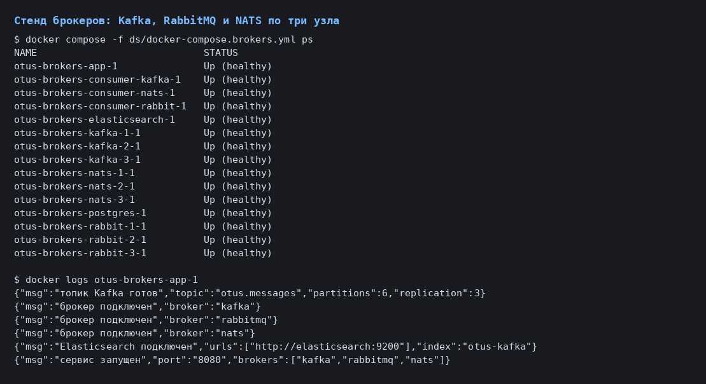
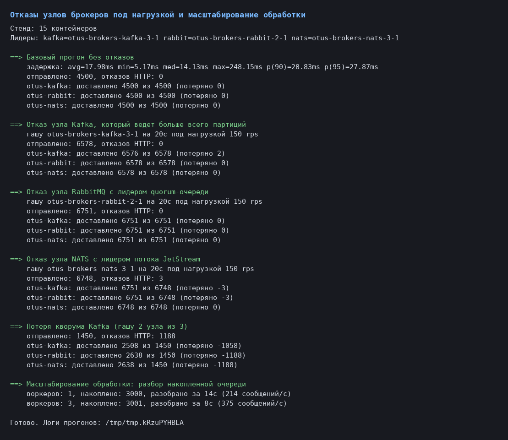
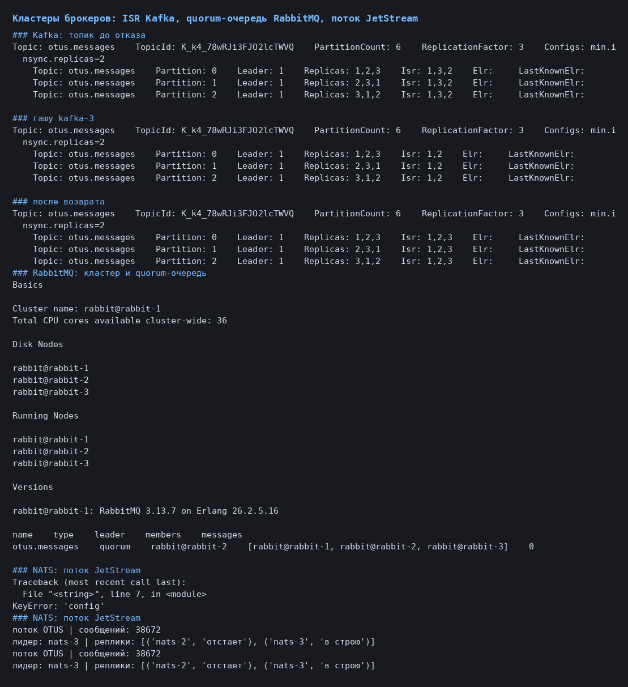
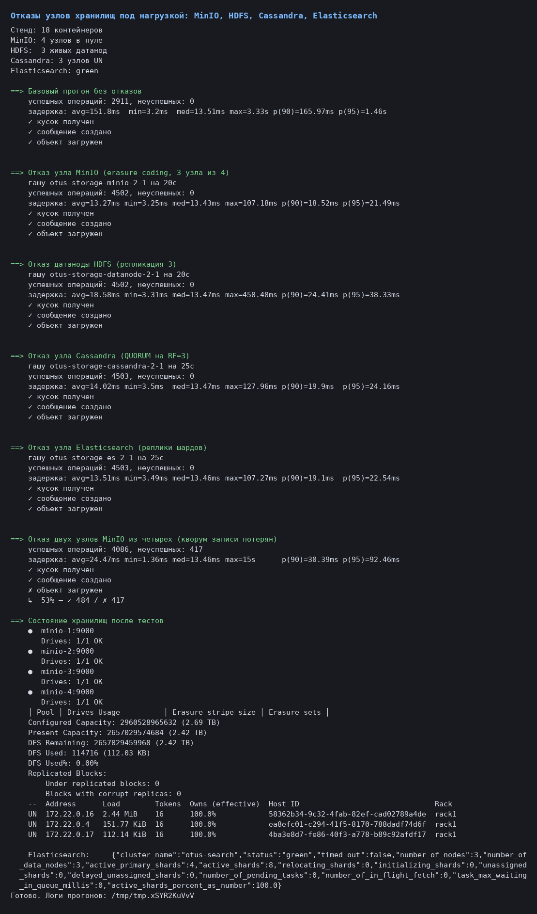
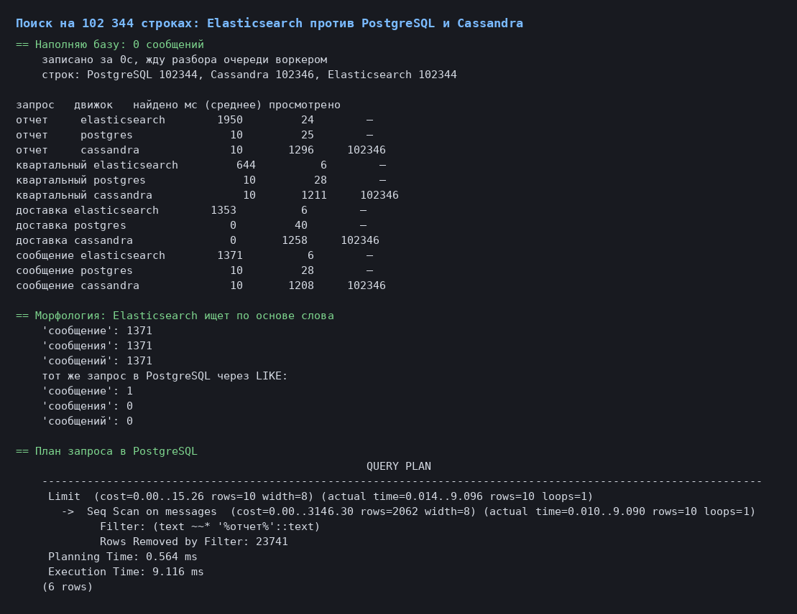
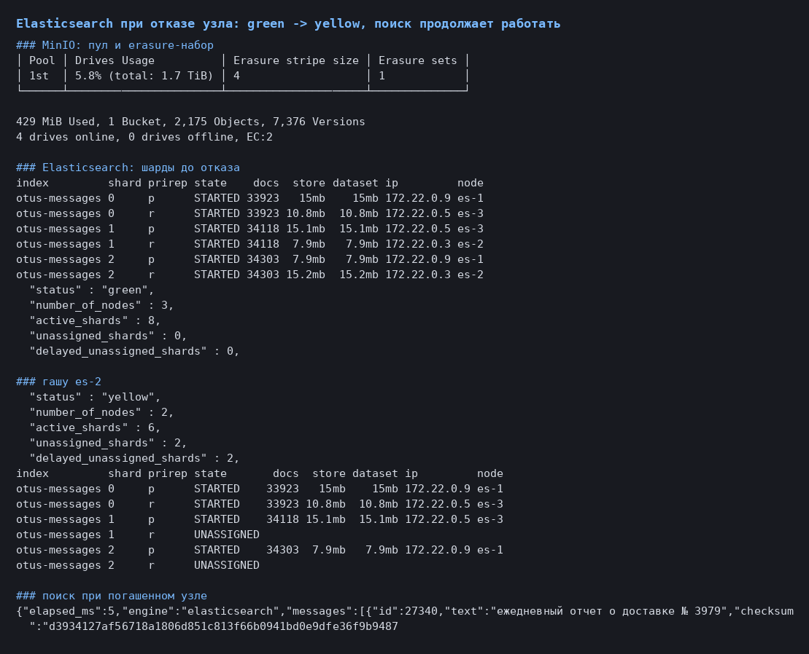
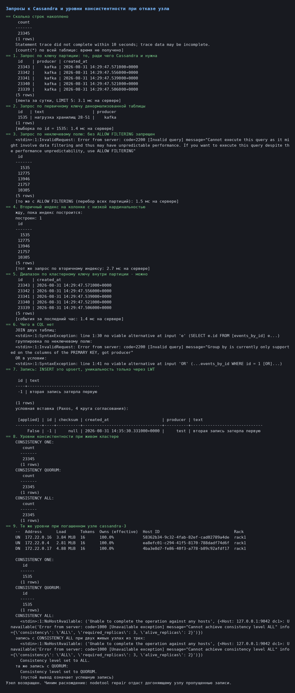
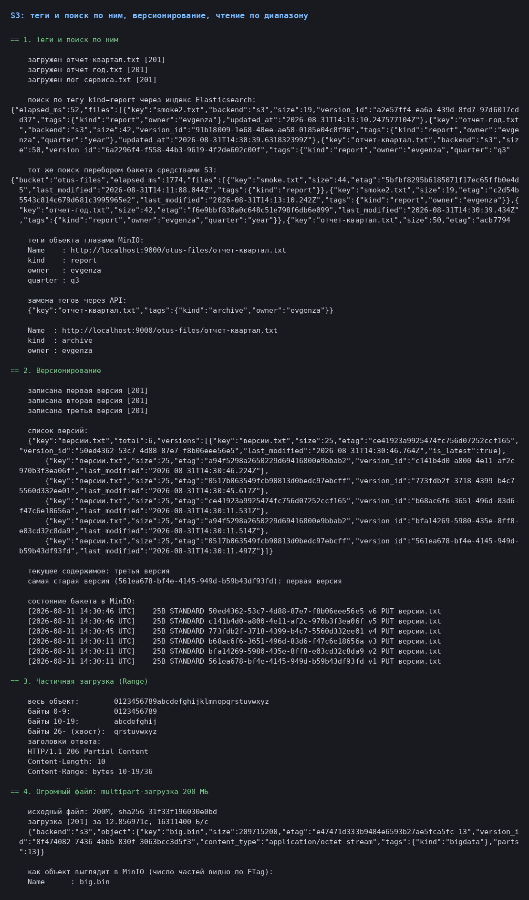
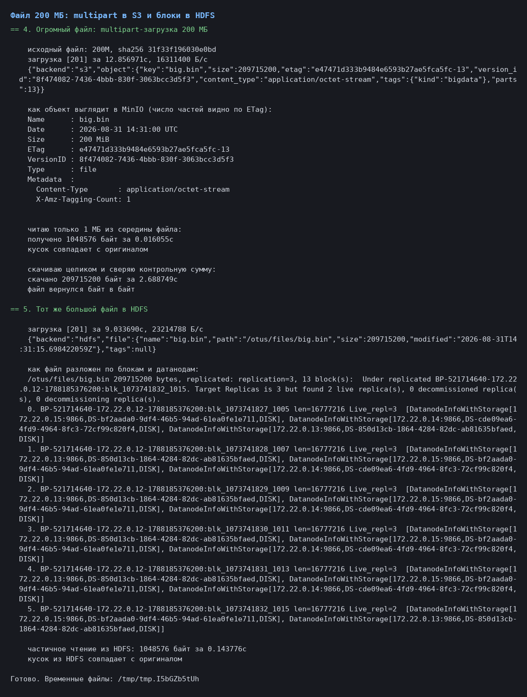

# Протокол проверки брокеров сообщений и распределенных хранилищ

Домашнее задание: подключить Kafka и RabbitMQ (со звездочкой - NATS),
протестировать брокеры под нагрузкой с масштабированием обработки и отказом
узлов; подключить S3, HDFS и Cassandra и провести нагрузочное тестирование с
отказами узлов хранения; настроить сбор и поиск данных в Elasticsearch.
Задачи со звездочкой - запросы к Cassandra и работа с S3 (теги и поиск по
ним, частичная загрузка, версионирование).

## Что построено

Одно событие проходит через всю систему: `POST /messages` сохраняет
сообщение в PostgreSQL и публикует событие сразу во все настроенные брокеры;
воркер `cmd/consumer` читает события из своего брокера и раскладывает их в
Cassandra (лента событий) и Elasticsearch (поисковый индекс). Файлы идут
мимо брокеров: `POST /files` кладет объект в S3 или в HDFS, а метаданные с
тегами дублирует в Elasticsearch.

```
                         ┌── Kafka ────┐
POST /messages ─ app ────┼── RabbitMQ ─┼── consumer ──┬── Cassandra   GET /events
                         └── NATS ─────┘              └── Elasticsearch  GET /search
POST /files ──── app ────┬── S3 (MinIO)  ── теги, версии, Range, multipart
                         └── HDFS        ── блоки по датанодам
```

Все интеграции включаются переменными окружения. Без них приложение работает
ровно как раньше: боевой стенд не тронут, там нет ни брокеров, ни новых
хранилищ.

Стендов два, поднимаются по очереди - вместе не помещаются в память:

| Стенд | Файл | Состав |
|---|---|---|
| Брокеры | `ds/docker-compose.brokers.yml` | Kafka 3 узла (KRaft), RabbitMQ 3 узла, NATS 3 узла, Elasticsearch, PostgreSQL, app, 3 воркера - 15 контейнеров |
| Хранилища | `ds/docker-compose.storage.yml` | MinIO 4 узла, HDFS (namenode + 3 датаноды), Cassandra 3 узла, Elasticsearch 3 узла, Kafka, PostgreSQL, app, воркер - 18 контейнеров |

```bash
make brokers-up && make brokers-test && make brokers-down
make storage-up && make storage-test && make s3-test && make cassandra-test && make search-bench
```



Стенду хранилищ нужно около 10 ГиБ памяти, доступной Docker. На 8 ГиБ узлы
Cassandra выбивает OOM-killer - это первое, что показал стенд.

## 1. Брокеры: как настроено и почему

| | Kafka | RabbitMQ | NATS JetStream |
|---|---|---|---|
| Репликация | топик RF=3, `min.insync.replicas=2` | quorum-очередь на 3 узлах (raft) | поток `R=3`, файловое хранилище |
| Подтверждение записи | `acks=all` | publisher confirms | ack от лидера потока |
| Раздача работы | consumer group, 6 партиций | конкурирующие консьюмеры, prefetch 32 | durable pull-консьюмер |
| Подтверждение обработки | ручной коммит offset после записи в хранилище | `ack`/`nack` с возвратом в очередь | `ack`/`nak` |

Общий принцип: без подтверждения от большинства реплик запись не считается
принятой, а сообщение не подтверждается, пока воркер не разложил его по
хранилищам. Обработка идемпотентна - в Cassandra ключ это id события, в
Elasticsearch документ пишется под тем же id, - поэтому повторная доставка
после отказа узла не плодит дубликаты.

Публикация в шину best-effort и параллельная: недоступный брокер не валит
запрос, но виден в метрике `otus_broker_published_total{result="error"}`.

## 2. Брокеры под нагрузкой

Сценарий k6 `loadtest/brokers.js` держит постоянные 150 запросов в секунду на
`POST /messages`; каждый запрос порождает три публикации.

```
задержка POST /messages: avg=17.98ms med=14.13ms p(90)=20.83ms p(95)=27.87ms
```

Из метрик приложения и воркеров за чистый прогон (4501 сообщение):

| Брокер | Публикация, среднее | Доставка до обработки, среднее |
|---|---|---|
| NATS JetStream | 0.65 мс | 103 мс |
| RabbitMQ (quorum + confirm) | 8.38 мс | 117 мс |
| Kafka (acks=all, RF=3) | 12.00 мс | 1833 мс |

NATS быстрее на порядок: подтверждение дает лидер потока в памяти, тогда как
Kafka ждет флаш на диск у всех синхронных реплик, а RabbitMQ - коммита в raft
quorum-очереди. Полторы секунды задержки доставки у Kafka - не вина брокера,
а следствие того, как читает воркер (см. масштабирование ниже).

## 3. Отказы узлов брокеров под нагрузкой

`scripts/broker-failover-test.sh` держит нагрузку, находит узел-лидер
(лидера партиций Kafka, лидера quorum-очереди RabbitMQ, лидера потока
JetStream), гасит его на 20 секунд, возвращает и считает, сколько событий
доехало до Elasticsearch. Доставку считаем от общего числа запросов, а не от
числа ответов 201: запрос, по которому клиент отвалился по таймауту, все
равно сохранил сообщение и опубликовал событие.

| Сценарий | Запросов | Kafka | RabbitMQ | NATS |
|---|---|---|---|---|
| Базовый прогон | 4500 | 4500 | 4500 | 4500 |
| Отказ узла Kafka с лидерами партиций | 6578 | 6576 (-2) | 6578 | 6578 |
| Отказ узла RabbitMQ с лидером очереди | 6751 | 6751 | 6751 | 6751 |
| Отказ узла NATS с лидером потока | 6751 | 6751 | 6751 | 6748 (-3) |
| Потеря кворума Kafka (2 узла из 3) | 2638 | 2508 (-130) | 2638 | 2638 |

Отказ одного узла в каждом из трех кластеров прошел без единой ошибки HTTP:
клиенты сами нашли новых лидеров. Потери в единицы событий - это публикации,
попавшие ровно в момент переключения лидера и исчерпавшие повторы.

Kafka при отказе узла честно переизбирает лидеров и сжимает список синхронных
реплик:

```
до отказа:      Partition: 0  Leader: 1  Replicas: 1,2,3  Isr: 1,3,2
kafka-3 погашен: Partition: 0  Leader: 1  Replicas: 1,2,3  Isr: 1,2
после возврата: Partition: 0  Leader: 1  Replicas: 1,2,3  Isr: 1,2,3
```

RabbitMQ держит очередь на трех узлах, лидер переезжает автоматически:

```
name            type    leader          members
otus.messages   quorum  rabbit@rabbit-2 [rabbit@rabbit-1, rabbit@rabbit-2, rabbit@rabbit-3]
```

NATS показывает поток и его реплики (вывод с узла-лидера):

```
поток OTUS | сообщений: 38672
лидер: nats-3 | реплики: [('nats-1', в строю), ('nats-2', в строю)]
```

### Потеря кворума Kafka

Два узла из трех погашены, `min.insync.replicas=2` больше не выполняется:

```
Kafka write errors: [19] Not Enough Replicas: the number of in-sync replicas
is lower than the configured minimum and requiredAcks is -1
```

Kafka потеряла 130 событий из 2638 (5%), RabbitMQ и NATS - ни одного: их
кластеры были целы. При этом 1188 запросов из 2638 клиент считал неуспешными:
публикация синхронная, и ожидание Kafka удерживало HTTP-ответ до таймаута
клиента. Ровно тот же урок, что и с etcd в прошлой работе: таймаут у клиента
не означает, что операция не выполнена - сообщения были сохранены и разосланы.





Практический вывод: синхронная веерная публикация связывает время ответа API
с самым медленным брокером. Правильное лечение - паттерн outbox: писать
событие в ту же транзакцию, что и сообщение, и отправлять его отдельным
процессом.

### Дефект, который вскрыл этот тест

Первый прогон потерял 891 событие, и все с одинаковой ошибкой:

```
"msg":"не удалось опубликовать событие","broker":"kafka","err":"context canceled"
```

Публикация шла с контекстом HTTP-запроса. Клиент отваливался по таймауту, Go
отменял контекст - и публикация уже сохраненного сообщения обрывалась на
полпути. Исправлено `context.WithoutCancel` со своим сроком: трассировка
сохраняется, отмена не наследуется. После исправления те же условия дали 130
потерь вместо 891, и все оставшиеся - настоящие отказы Kafka без кворума.

## 4. Масштабирование обработки

Воркеры гасятся, нагрузка копит очередь, воркеры поднимаются - меряем, за
сколько разбирается накопленное.

| Режим | Накоплено | Разобрано | Скорость |
|---|---|---|---|
| 1 воркер, коммит offset на каждое событие | 4000 | 20.3 с | 196 событий/с |
| 1 воркер, коммит пачкой раз в секунду | 4000 | 18.6 с | 214 событий/с |
| 3 воркера, коммит пачкой | 4001 | 10.3 с | 386 событий/с |

Пакетный коммит дал всего 9% - значит, упирались не в него. Потолок одного
воркера в ~200 событий в секунду задает синхронный поход в Elasticsearch на
каждое событие (~5 мс на запрос, по одному запросу в полете). Отсюда и
задержка доставки в 1.8 секунды у Kafka при 150 rps: воркер работает на
пределе, и очередь копится. Три воркера дают почти двукратный, но не
трехкратный рост - упирается уже одноузловой Elasticsearch. Правильное
решение - не наращивать воркеры, а перейти на bulk-индексацию.

## 5. Хранилища: как настроено

| Система | Конфигурация | Роль в приложении |
|---|---|---|
| MinIO (S3) | 4 узла, erasure coding EC:2, stripe 4, версионирование включено | файлы: `POST /files`, `GET /files/{key}` с `Range`, теги, версии |
| HDFS | namenode + 3 датаноды, репликация 3, блок 16 МБ | те же маршруты с `?backend=hdfs` |
| Cassandra | 3 узла, RF=3, запись и чтение QUORUM | лента событий `GET /events`, выборка по ключу `GET /events/{id}` |
| Elasticsearch | 3 узла, индекс на 3 шарда с 1 репликой, русский анализатор | `GET /search`, поиск файлов по тегам |

Схема Cassandra спроектирована под запросы, а не под данные: одна таблица с
партицией на сутки для ленты и вторая с идентификатором в ключе для точечной
выборки. Обе пишутся одним логированным батчем.

## 6. Отказы узлов хранилищ под нагрузкой

`scripts/storage-failover-test.sh` держит смешанную нагрузку 100 операций в
секунду (60 созданий сообщений, 20 загрузок объектов, 20 чтений диапазона) и
по очереди гасит узлы.

| Сценарий | Операций | Неуспешных | Задержка p95 |
|---|---|---|---|
| Базовый прогон | 3002 | 0 | 15.9 мс |
| Отказ узла MinIO (1 из 4) | 4502 | 0 | 21.5 мс |
| Отказ датаноды HDFS (1 из 3) | 4502 | 0 | 38.3 мс |
| Отказ узла Cassandra (1 из 3) | 4503 | 0 | 24.2 мс |
| Отказ узла Elasticsearch (1 из 3) | 4503 | 0 | 22.5 мс |
| Отказ 2 узлов MinIO из 4 | 4503 | 417 | 92.5 мс |

Отказ одного узла не заметил никто. Отказ двух узлов MinIO из четырех разделил
операции ровно по границе кворума:

```
✓ сообщение создано    100%
✓ кусок получен        100%
✗ объект загружен       53% — ✓ 484 / ✗ 417
```

Это и есть erasure coding: при `EC:2` на четырех дисках чтение собирается из
двух оставшихся, а запись требует кворума и падает. Elasticsearch на отказ
узла отвечает переходом в yellow с потерей копий, но primary-шарды остаются
на живых узлах, и поиск продолжает работать:

```
до отказа:      status green,  nodes 3, active_shards 8, unassigned 0
es-2 погашен:   status yellow, nodes 2, active_shards 6, unassigned 2
поиск при этом: GET /search?q=отчет -> 200 за 5 мс
```



Главная проверка - сходимость данных. Асинхронный путь (брокер -> воркер ->
Cassandra + Elasticsearch) отработал весь прогон с отказами узлов без единой
ошибки:

```
сообщений в PostgreSQL:      19741
событий в Cassandra:         19741
документов в Elasticsearch:  19741
ошибок воркера:              0
```

## 7. Elasticsearch: сбор и поиск

Воркер индексирует каждое событие под его же идентификатором, приложение
ищет через `GET /search?q=...`. Индекс с русским анализатором: стоп-слова
плюс стеммер. Параметр `engine` позволяет выполнить тот же запрос в
PostgreSQL (`ILIKE`) или в Cassandra (перебор таблицы) - сравнение
получается на одних и тех же данных.

На 102 344 сообщениях, среднее по 5 прогонам:

| Запрос | Elasticsearch | PostgreSQL `ILIKE` | Cassandra (перебор) |
|---|---|---|---|
| отчет | 24 мс, 1950 совпадений | 25 мс, отдал 10 | 1296 мс, просмотрено 102 346 |
| квартальный | 6 мс, 644 | 28 мс, отдал 10 | 1211 мс |
| доставка | 6 мс, 1353 | 40 мс, нашел 0 | 1258 мс, нашел 0 |
| сообщение | 6 мс, 1371 | 28 мс, отдал 10 | 1208 мс |

Те же запросы на 26 тысячах строк давали Elasticsearch 7-38 мс, PostgreSQL
0-13 мс, Cassandra 343-476 мс. Рост объема в 3.8 раза утроил время у
PostgreSQL и Cassandra и не изменил его у Elasticsearch - разница именно в
том, что один читает индекс, а двое других читают все.

`ILIKE '%подстрока%'` не может использовать индекс, и это видно в плане:

```
Limit  (cost=0.00..15.26 rows=10) (actual time=0.014..9.096 rows=10)
  ->  Seq Scan on messages  (actual time=0.010..9.090 rows=10)
        Filter: (text ~~* '%отчет%'::text)
        Rows Removed by Filter: 23741
```

Но скорость - не главное преимущество. Полнотекстовый поиск отвечает на
вопрос, на который два других не отвечают вовсе:

| Запрос | Elasticsearch | PostgreSQL `ILIKE` |
|---|---|---|
| сообщение | 1371 | 1 |
| сообщения | 1371 | 0 |
| сообщений | 1371 | 0 |

Стеммер приводит словоформы к одной основе, `LIKE` сравнивает подстроки. Для
русского текста это разница между поиском и его имитацией. Плюс к этому
Elasticsearch бесплатно отдает общее число совпадений и релевантность, а
PostgreSQL с `LIMIT` останавливается на первых десяти и общего числа не
знает; Cassandra не знает и не может узнать.

Честности ради: у PostgreSQL есть `tsvector` с GIN-индексом, и он тоже умеет
морфологию. Выбор Elasticsearch оправдан не тем, что альтернативы нет, а тем,
что поисковый индекс живет отдельно от транзакционной базы: тяжелые запросы
не конкурируют с записью, индекс переживает отказ узла своими репликами и
масштабируется отдельно от основного хранилища.

Тот же прием работает и для файлов. В S3 нет поиска по тегам - их можно
только прочитать у известного объекта, - поэтому метаданные дублируются в
индекс:

| Способ найти файлы с тегом `kind=report` | Время |
|---|---|
| Индекс Elasticsearch | 47 мс |
| Перебор бакета: список плюс запрос тегов на каждый объект | 2032 мс |





На 2175 объектах разница в 43 раза, и она линейно растет с размером бакета.

## 8. Задача со звездочкой: NATS

NATS проверен наравне с Kafka и RabbitMQ - те же публикация с
подтверждением, durable-консьюмер, отказ узла с лидером потока под нагрузкой
(таблицы в разделах 2 и 3). Итог: самая быстрая публикация из трех (0.65 мс
против 8.38 и 12.00), потеря 3 событий из 6751 при отказе лидера потока,
самая простая настройка кластера - три флага в командной строке против
конфигов и служебных топиков у соседей. Обратная сторона - JetStream моложе,
у него нет ни экосистемы коннекторов Kafka, ни зрелых средств управления
RabbitMQ, а хранение потока ограничено политиками retention, которые надо
задавать осознанно.

## 9. Задача со звездочкой: запросы к Cassandra

`scripts/cassandra-queries-test.sh`, время измерено трассировкой на сервере
(`TRACING ON`), таблица - 23 345 строк.

| Запрос | Время | Что происходит |
|---|---|---|
| По ключу партиции (лента за сутки, LIMIT 5) | 3.1 мс | один узел, одна партиция |
| По первичному ключу `events_by_id` | 1.4 мс | точечное чтение |
| По неключевой колонке с `ALLOW FILTERING` | 1.5 мс | `LIMIT 5` останавливает перебор на первом же диапазоне |
| То же по вторичному индексу | 2.7 мс | индекс сначала надо построить |
| `count(*)` по таблице | 509 мс | 49 диапазонов, обход всего кольца |

Запрос по неключевой колонке без `ALLOW FILTERING` просто запрещен:

```
InvalidRequest: Cannot execute this query as it might involve data filtering
and thus may have unpredictable performance
```

Чего в CQL нет совсем: `JOIN` (синтаксическая ошибка), `GROUP BY` по
неключевой колонке (`Group by is currently only supported on the columns of
the PRIMARY KEY`), `OR` в условии. Поэтому данные и лежат в двух таблицах:
запрос проектируется первым, таблица - под него.

`INSERT` в Cassandra это upsert, уникальности нет:

```
INSERT ... VALUES (-1, 'первая запись', ...);
INSERT ... VALUES (-1, 'вторая запись затерла первую', ...);
SELECT id, text FROM events_by_id WHERE id = -1;
 -1 | вторая запись затерла первую
```

Уникальность дает только легковесная транзакция, и она платит за это четырьмя
раундами Paxos:

```
INSERT ... IF NOT EXISTS;
 [applied] | id | text
     False | -1 | вторая запись затерла первую
```

Уровни консистентности при живом кластере из трех узлов работают все.
Погасим один узел:

```
UN  172.22.0.16   ...
UN  172.22.0.4    ...
DN  172.22.0.17   ...

CONSISTENCY ONE     -> строка прочитана
CONSISTENCY QUORUM  -> строка прочитана
CONSISTENCY ALL     -> Cannot achieve consistency level ALL
                       info={'required_replicas': 3, 'alive_replicas': 2}
```

Запись с `ALL` при двух живых узлах падает, с `QUORUM` проходит. Приложение
работает на QUORUM, поэтому отказ узла оно и не заметило (раздел 6). Отдельно
всплыло, что вторичный индекс строится не мгновенно: запрос по нему во время
сборки вернул `ReadFailure`, и только после ее завершения стал отвечать.



Вывод по Cassandra как по базе данных: это не реляционная СУБД с другим
синтаксисом, а хранилище, где стоимость запроса известна заранее, если он
идет по ключу, и не ограничена ничем, если не идет. Наша лента событий и
выборка по идентификатору ложатся на эту модель идеально; полнотекстовый
поиск по тому же набору данных - нет, что и показал раздел 7.

## 10. Задача со звездочкой: работа с S3

`scripts/s3-features-test.sh`.

**Теги и поиск по ним.** Теги ставятся при загрузке (`?tags=kind=report,owner=evgenza`)
и заменяются через `PUT /files/{key}/tags`. MinIO подтверждает:

```
Name    : http://localhost:9000/otus-files/отчет-квартал.txt
kind    : report
owner   : evgenza
quarter : q3
```

Поиск по тегам средствами S3 - это перебор бакета с запросом тегов на каждый
объект (2032 мс против 47 мс по индексу, раздел 7).

**Версионирование.** Бакет создается с включенным версионированием, поэтому
перезапись не затирает, а добавляет версию:

```
[14:30:11 UTC] 25B b68ac6f6-3651-496d-83d6-f47c6e18656a v3 PUT версии.txt
[14:30:11 UTC] 25B bfa14269-5980-435e-8ff8-e03cd32c8da9 v2 PUT версии.txt
[14:30:11 UTC] 25B 561ea678-bf4e-4145-949d-b59b43df93fd v1 PUT версии.txt

текущее содержимое:            третья версия
версия 561ea678-...:           первая версия
```



**Частичная загрузка.** Заголовок `Range` уходит в хранилище, а не режется на
стороне приложения:

```
$ curl -H 'Range: bytes=10-19' .../files/диапазон.txt
HTTP/1.1 206 Partial Content
Content-Length: 10
Content-Range: bytes 10-19/36
abcdefghij
```

**Огромный файл.** 200 МБ уходят multipart-загрузкой по 16 МБ - клиент режет
поток сам, размер тела заранее знать не обязательно. Число частей видно в
ETag:

```
{"key":"big.bin","size":209715200,"etag":"e47471d333b9484e6593b27ae5fca5fc-13","parts":13}
загрузка: 12.9 с (16 МБ/с)
скачивание целиком: 2.7 с, файл вернулся байт в байт
чтение 1 МБ из середины: 16 мс
```

Гигабайты качать целиком, чтобы прочитать мегабайт из середины, не нужно:
диапазонное чтение того же файла в 168 раз быстрее полной выгрузки.

**Тот же файл в HDFS.** Он режется на 13 блоков по 16 МБ, каждый лежит на
трех датанодах:

```
/otus/files/big.bin 209715200 bytes, replicated: replication=3, 13 block(s)
0. blk_1073741827_1005 len=16777216 Live_repl=3 [172.22.0.15, 172.22.0.14, 172.22.0.13]
5. blk_1073741832_1015 len=16777216 Live_repl=2 [172.22.0.15, 172.22.0.13]
   Under replicated ... Target Replicas is 3 but found 2 live replica(s)
```

Последний блок сразу после записи еще догоняет третью копию - видно, что
репликация асинхронна и namenode сам доводит ее до целевой. Частичное чтение
из HDFS тоже есть (144 мс на 1 МБ) - дороже, чем в S3, потому что клиент
сначала спрашивает у namenode расположение блоков и только потом идет к
датаноде.



## 11. Что вскрыли проверки

Четыре дефекта, найденные не глазами, а нагрузкой:

1. **Публикация умирала вместе с запросом.** Контекст HTTP-запроса отменялся
   при таймауте клиента и обрывал отправку уже сохраненного сообщения - 891
   потерянное событие. Лечится `context.WithoutCancel` со своим сроком.
2. **Гонка при создании индекса Elasticsearch.** Приложение и воркер
   стартуют одновременно, оба создают индекс, проигравший получал
   `resource_already_exists_exception` и молча оставался без поиска. Теперь
   эта ошибка трактуется как успех.
3. **Файл в HDFS оставался незакрытым.** `Close` возвращает
   `replication in progress`, пока блоки не разошлись по датанодам; без
   повторов запись падала. Добавлены повторы с нарастающей паузой - так же
   делает штатный java-клиент.
4. **`refresh` на каждую запись в Elasticsearch.** Обходится в полтора раза
   по p95 (24 мс против 16 мс) и не нужен: документ и так виден через
   секунду. Выключен по умолчанию, включается переменной `ELASTIC_REFRESH`.

Пятое - не дефект кода, а урок про стенд: namenode переформатировал
файловую систему при каждом рестарте контейнера, датаноды со старым
cluster id отказывались регистрироваться, и HDFS оставался без единой живой
датаноды. Формат теперь выполняется только при первом запуске.

## Оценка результатов

- Три брокера подключены одинаково честно - с репликацией, подтверждением
  записи и ручным подтверждением обработки. Отказ узла в каждом из трех
  кластеров прошел под нагрузкой без ошибок HTTP и с потерями в единицы
  событий на десятки тысяч.
- Потеря кворума ломает только тот брокер, который его потерял. Разница
  между "узел упал" и "кворум потерян" гораздо важнее, чем разница между
  брокерами: первое переживается прозрачно, второе требует осознанной
  деградации на стороне приложения.
- Масштабирование обработки показало, что узкое место не там, где кажется:
  не в коммитах offset и не в брокере, а в синхронном походе воркера в
  Elasticsearch на каждое событие.
- Все четыре распределенных хранилища пережили отказ узла без единой
  неуспешной операции, а сходимость данных на выходе точная: 19 741
  сообщение в PostgreSQL, столько же событий в Cassandra и документов в
  Elasticsearch.
- Elasticsearch выигрывает у альтернатив не столько скоростью на небольших
  объемах, сколько тем, что его время не растет с объемом данных, и тем, что
  он умеет искать по словоформам. Для русского текста это решающий довод.
