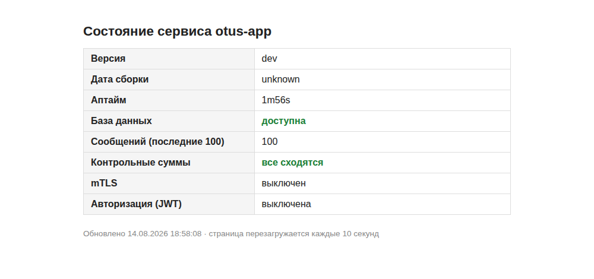
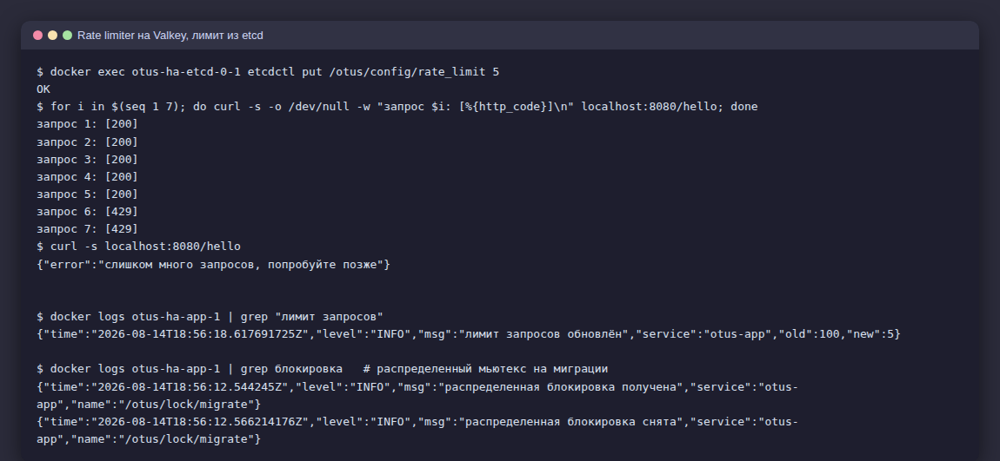
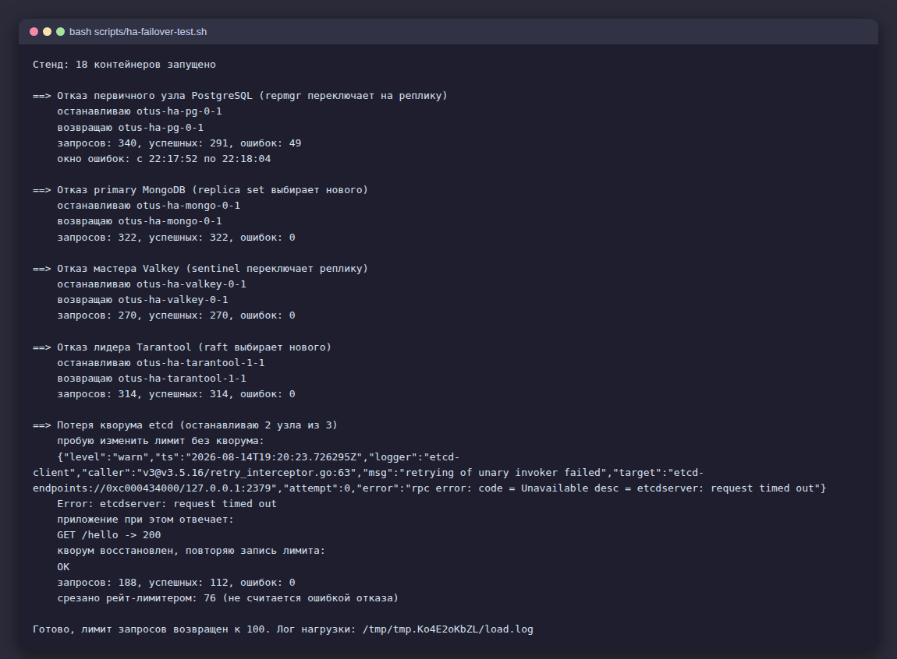
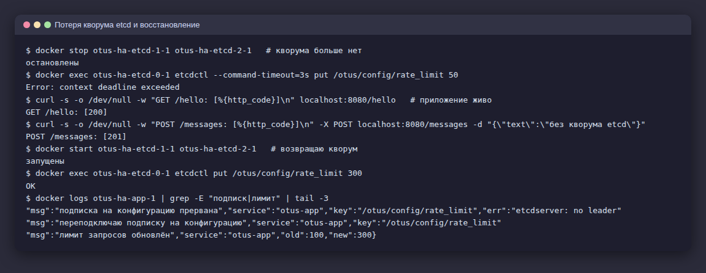
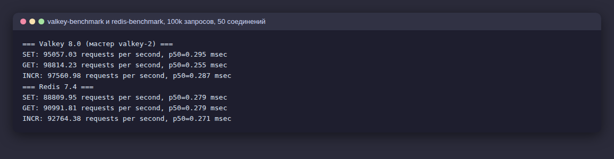

# Протокол проверки работы с СУБД и кэшированием

Домашнее задание: подключить СУБД в отказоустойчивом режиме (PostgreSQL,
MongoDB, Valkey/Redis, Tarantool/Picodata, etcd), реализовать шаблоны
Rate Limiter и распределенного мьютекса, выполнить тесты отказов узлов под
нагрузкой. Задание со звездочкой - сравнение альтернативных решений.

## Схема стенда

Отказоустойчивый стенд поднимается локально (`ha/docker-compose.ha.yml`,
18 контейнеров). На боевой сервер он не деплоится - пять кластеров не
помещаются в его 3.8Gi памяти, а прод продолжает работать на прежней схеме:
все новые интеграции в приложении включаются переменными окружения и без
них не активируются.

```
app :8080
  PostgreSQL  pg-0, pg-1              repmgr, потоковая репликация
  MongoDB     mongo-0..2              replica set rs0
  Valkey      valkey-0..2             master + 2 реплики
              sentinel-0..2           кворум 2, автопереключение
  Tarantool   tarantool-0..2          replicaset, raft election
  etcd        etcd-0..2               кластер из 3 узлов
```

Как приложение использует каждую систему:

- **PostgreSQL** - основное хранилище сообщений. В DSN перечислены оба узла
  с `target_session_attrs=read-write`: pgx сам находит живой primary после
  переключения.
- **MongoDB** - аудит-лог созданных сообщений (write concern majority),
  наружу отдается через `GET /audit`.
- **Valkey** - счетчики Rate Limiter, клиент ходит через sentinel и
  переживает смену мастера.
- **Tarantool** - кэш ответа `GET /messages` с TTL 10 секунд (заголовок
  `X-Cache: HIT/MISS`), создание сообщения сбрасывает кэш. Пул клиента
  знает все три узла и шлет записи туда, где сейчас RW. Кэш нестрогий: при
  гонке создания и чтения свежая запись может не попасть в закэшированный
  список, устаревание ограничено TTL.
- **etcd** - распределенный мьютекс на миграции схемы и живая конфигурация
  лимита запросов (watch на ключ `/otus/config/rate_limit`).

Запуск стенда и тестов:

```bash
cd ha && docker compose -f docker-compose.ha.yml up -d --build && cd ..
bash scripts/ha-failover-test.sh
```



## 1. Rate Limiter

Счетчик в фиксированном минутном окне на Valkey: middleware инкрементирует
ключ `rl:<ip>:<окно>` (INCR + EXPIRE в одной транзакции) и отдает 429 при
превышении. IP берется из X-Forwarded-For - в проде его выставляет nginx,
прямого доступа к приложению снаружи нет. Лимит хранится в etcd и
применяется на лету без рестарта:

```
$ docker exec otus-ha-etcd-0-1 etcdctl put /otus/config/rate_limit 5
OK
$ for i in $(seq 1 7); do curl -s -o /dev/null -w "запрос $i: [%{http_code}]\n" localhost:8080/hello; done
запрос 1: [200]
...
запрос 5: [200]
запрос 6: [429]
запрос 7: [429]
$ curl -s localhost:8080/hello
{"error":"слишком много запросов, попробуйте позже"}
```

Если Valkey недоступен целиком, лимитер работает по принципу fail-open:
запрос пропускается с предупреждением в логе - деградация ограничения
безопаснее отказа всего API.



## 2. Распределенный мьютекс

Мьютекс на etcd (`concurrency.Mutex` поверх session с TTL 15 секунд)
защищает миграцию схемы БД: при одновременном старте нескольких реплик
приложения таблицы создает только один экземпляр, остальные ждут снятия
блокировки.

```
"msg":"распределенная блокировка получена","name":"/otus/lock/migrate"
"msg":"распределенная блокировка снята","name":"/otus/lock/migrate"
```

Если etcd недоступен при старте, приложение логирует предупреждение и
выполняет миграцию без блокировки - идемпотентные `CREATE TABLE IF NOT
EXISTS` делают это безопасным.

## 3. Тесты отказов узлов под нагрузкой

Скрипт `scripts/ha-failover-test.sh` держит постоянную нагрузку
(POST + GET `/messages`, около 9 запросов в секунду; на время теста лимит
запросов поднимается через etcd, чтобы рейт-лимитер не искажал статистику),
в середине убивает узел, ждет переключения, возвращает узел и считает
ошибки:

Первичный узел каждого кластера скрипт находит сам перед остановкой
(pg_is_in_recovery, rs.hello, sentinel get-master-addr, box.info.ro) -
после каждого прогона роли переезжают, и без этого сценарии убивали бы
реплику вместо мастера.

| Сценарий | Запросов | Ошибок | Наблюдение |
|---|---|---|---|
| Отказ primary PostgreSQL | 340 | 49 | окно ошибок 12 секунд, repmgr сделал promote реплики, pgx переключился по `target_session_attrs` |
| Отказ primary MongoDB | 322 | 0 | replica set выбрал нового primary, драйвер перешел прозрачно |
| Отказ мастера Valkey | 270 | 0 | sentinel: `+switch-master mymaster valkey-0 -> valkey-2`, на время выборов лимитер работал fail-open |
| Отказ лидера Tarantool | 314 | 0 | raft выбрал нового лидера, кэш продолжил писать через pool.RW |
| Потеря кворума etcd (2 из 3) | 188 | 0 | 76 запросов срезал рейт-лимитер - см. подробности ниже |



Свидетельства переключений из логов:

```
pg-1:      [NOTICE] this node is the only available candidate and will now promote itself
           NOTICE: promoting server "pg-1" (ID: 1001) using pg_promote()
mongo:     mongo-0 SECONDARY / mongo-1 SECONDARY / mongo-2 PRIMARY
sentinel:  +switch-master mymaster valkey-0 6379 valkey-2 6379
tarantool: RAFT: enter candidate state with 1 self vote
           RAFT: enter leader state with quorum 2
```

Вывод по PostgreSQL: единственный сценарий с видимыми ошибками - от отказа
primary до завершения promote проходит около 10 секунд (repmgr должен
убедиться, что узел действительно мертв). Это ожидаемая плата за
автоматический failover без внешнего балансировщика; сократить окно можно
агрессивными таймаутами repmgr или переходом на Patroni.

## 4. Работа без кворума

Отдельно проверено состояние кластера etcd без кворума - остановлены 2 узла
из 3:

- запись в etcd невозможна: `etcdctl put` падает по таймауту
  (`etcdserver: request timed out`), оставшийся узел не может подтвердить
  запись большинством;
- приложение продолжает обслуживать запросы: `GET /hello` - 200,
  `POST /messages` - 201. Конфигурация и мьютекс - вспомогательные
  зависимости, их недоступность не валит API;
- watch на конфигурацию рвется (`etcdserver: no leader`), приложение
  переподключает подписку в цикле и после восстановления кворума
  дочитывает актуальное значение - смена лимита через
  `etcdctl put ... 300` применилась сразу после возврата узлов;
- таймаут записи не означает, что записи не было. Упавший по таймауту
  `put rate_limit 5` успел лечь в raft-лог оставшегося узла и закоммитился
  сразу после восстановления кворума - лимит 5 внезапно применился, и
  нагрузка успела поймать 76 ответов 429, пока скрипт не вернул лимит
  обратно. Практический вывод: клиент etcd обязан трактовать timeout как
  неопределенность и перепроверять состояние, а не считать запись
  несостоявшейся.

```
"msg":"подписка на конфигурацию прервана","err":"etcdserver: no leader"
"msg":"переподключаю подписку на конфигурацию"
"msg":"лимит запросов обновлён","old":100,"new":300
```

У MongoDB потеря кворума выглядит иначе: replica set из 3 узлов при двух
погашенных узлах переводит оставшийся в SECONDARY - записи с write concern
majority невозможны, аудит-лог пишет предупреждения, но чтение с
`readPreference` из вторичного узла остается доступным. Общий вывод: все
кворумные системы стенда без большинства узлов жертвуют записью, а
приложение должно уметь жить с этим - у нас это fail-open лимитера,
best-effort аудит и деградация кэша до похода в БД.



## 5. Задание со звездочкой: сравнение альтернатив

**Valkey против Redis.** Одинаковый прогон `*-benchmark` (100k запросов,
50 соединений, контейнеры на одной машине):

| Операция | Valkey 8.0 | Redis 7.4 |
|---|---|---|
| SET | 95 057 rps | 88 810 rps |
| GET | 98 814 rps | 90 992 rps |
| INCR | 97 561 rps | 92 764 rps |

Valkey стабильно быстрее на 5-8% (в 8.0 переписан event loop с частичной
многопоточностью ввода-вывода), при том что наш Valkey еще и обслуживал
двух реплик. Протокол и API совместимы - go-redis работает с обоими без
изменений кода. Главное отличие не техническое, а лицензионное: Redis с
7.4 перешел на RSALv2/SSPLv1, Valkey остался под BSD в Linux Foundation.
Для нового проекта это делает Valkey выбором по умолчанию.



**Tarantool против Picodata.** Tarantool - зрелая in-memory СУБД с Lua на
борту; кластеризация в 3.x собирается руками из декларативного конфига
(replicaset + raft election, как на нашем стенде), а шардирование - это
отдельный vshard. Picodata - форк Tarantool от российской команды, где
распределенность встроена с самого начала: raft-группа управляет топологией
целиком, узлы добавляются одной командой, управляющая плоскость написана на
Rust, есть распределенный SQL. Для нашего сценария (маленький кэш)
Tarantool проще и достаточен; Picodata имеет смысл смотреть, когда нужен
именно кластер из десятков узлов с шардированием из коробки.

**etcd против ZooKeeper/Consul.** etcd выбран для конфигурации и
блокировок из-за простого HTTP/gRPC API, нативного Go-клиента с готовым
`concurrency`-пакетом и линеаризуемых операций поверх raft. ZooKeeper
требует JVM и своего клиентского протокола, Consul тянет за собой целую
service-mesh экосистему. Для трех ключей и одного мьютекса etcd - самый
дешевый по сложности вариант; те же три узла заодно могли бы служить DCS
для Patroni.

## Оценка результатов

- Все пять систем подняты в отказоустойчивом режиме и подключены к
  приложению, каждая со своей ролью - не стенд ради стенда, а рабочие
  паттерны: HA-хранилище, аудит, кэш, лимитер, координация.
- Тесты отказов показали главное отличие подходов: системы с боковым
  механизмом failover (repmgr) дают окно недоступности в секунды, системы
  со встроенным консенсусом (Mongo, raft у Tarantool, sentinel-кворум)
  переключаются незаметно для клиента с multi-node подключением.
- Потеря кворума везде означает потерю записи, и это не чинится со стороны
  СУБД - приложение обязано деградировать осознанно. Проверка вскрыла
  реальный дефект: watch etcd после потери лидера молча умирал, подписку
  пришлось научить переподключаться.
- Из сравнения альтернатив практический вывод один: совместимость Valkey с
  Redis делает миграцию бесплатной, а лицензия и производительность -
  оправданной.
