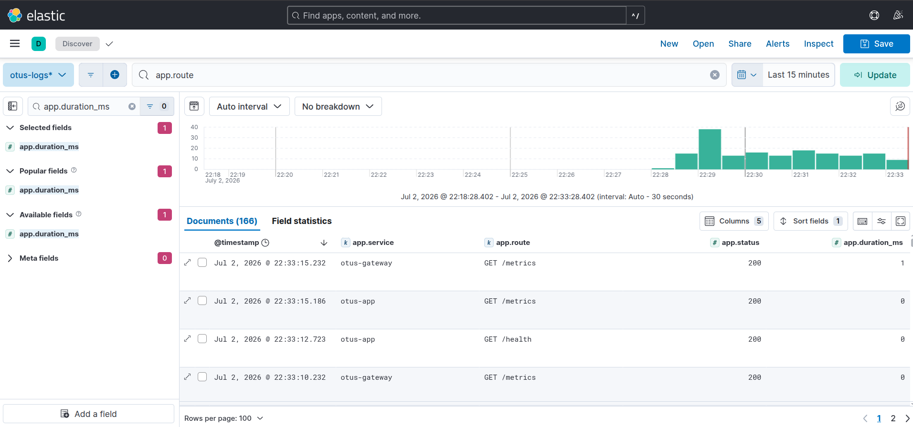
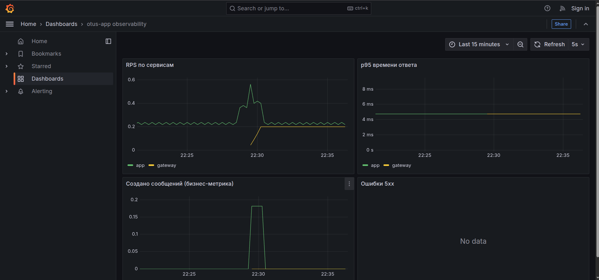
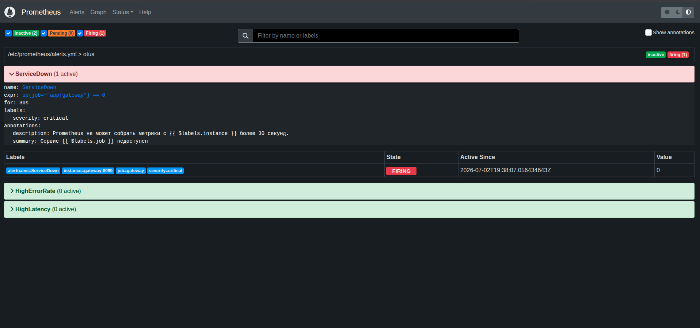
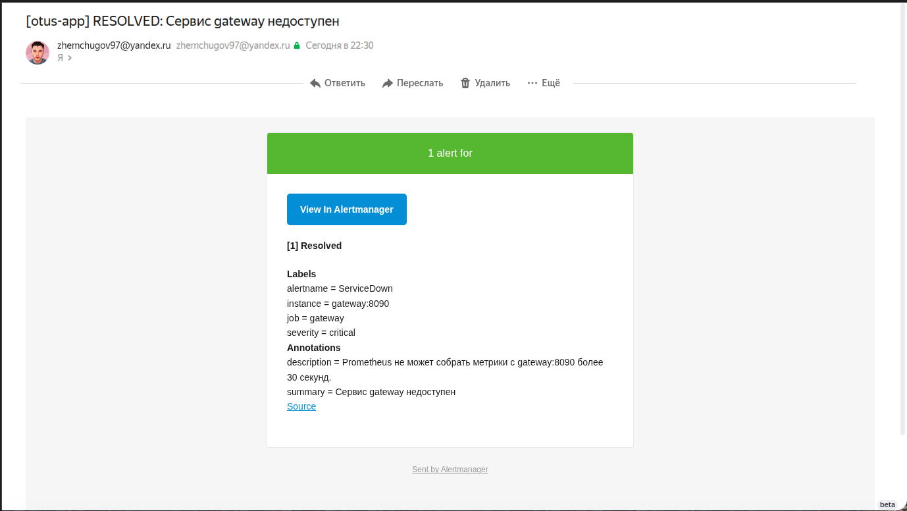
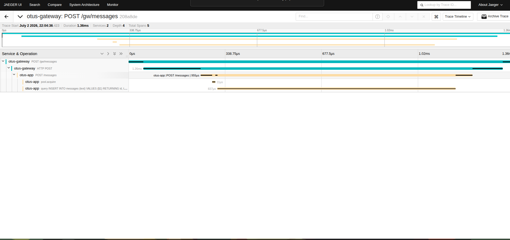
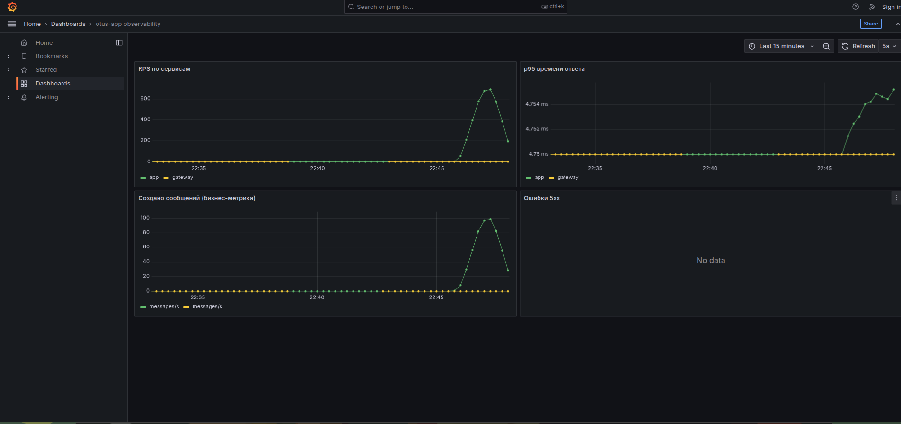

# Протокол проверки наблюдаемости otus-app

## Что за система

Два микросервиса на Go + PostgreSQL:

- **gateway** (порт 8090) — принимает запросы `/gw/messages` и проксирует их в app;
- **app** (порт 8080) — бизнес-логика, пишет/читает сообщения в PostgreSQL.

Цепочка вызова: `gateway → app → PostgreSQL`. На ней и проверяем наблюдаемость.

Стек наблюдаемости поднимается через `observability/docker-compose.yml`:
Prometheus, Alertmanager, Grafana, Jaeger, Elasticsearch + Kibana + Filebeat,
postgres-exporter.

```bash
cd observability
cp .env.example .env                      # заполнить SMTP при необходимости
docker compose up -d
```

UI после старта: Grafana `:3000`, Prometheus `:9090`, Alertmanager `:9093`,
Jaeger `:16686`, Kibana `:5601`.

## 1. Логирование (ELK)

Оба сервиса пишут **структурные JSON-логи** (`log/slog`) в stdout. Filebeat
читает логи контейнеров, отбирает только наши сервисы (`app`, `gateway`),
парсит JSON и шлёт в Elasticsearch; смотрим в Kibana.

Пример строки лога приложения:

```json
{"time":"...","level":"INFO","msg":"http_request","service":"otus-app",
 "method":"POST","route":"POST /messages","status":201,"duration_ms":3}
```

Проверка — логи обоих сервисов доходят до Elasticsearch:

```
$ curl -s 'localhost:9200/otus-logs*/_search' -d '{"aggs":{"svc":{"terms":{"field":"app.service"}}}}'
  otus-app      32
  otus-gateway  14
```

В Kibana создаётся data view `otus-logs*`, поля разбираются (`app.service`,
`app.route`, `app.status`, `app.duration_ms`).



## 2. Метрики (Prometheus + Grafana)

Каждый сервис отдаёт метрики на `/metrics`. Prometheus собирает их с app,
gateway и postgres-exporter. Метрики:

- `otus_http_requests_total{method,route,status}` — счётчик запросов;
- `otus_http_request_duration_seconds` — гистограмма времени ответа;
- `otus_messages_created_total` — **бизнес-метрика**: сколько сообщений сохранено.

Все таргеты Prometheus в состоянии `up`:

```
app up   gateway up   postgres up   prometheus up
```

Бизнес-метрика растёт при создании сообщений:

```
otus_messages_created_total 15
```

Дашборд Grafana: RPS по сервисам, p95 времени
ответа, скорость создания сообщений, ошибки 5xx.



## 3. Алертинг (Alertmanager → почта)

Правила в `observability/prometheus/alerts.yml`:

- **ServiceDown** — сервис не отдаёт метрики (`up == 0`) 30 секунд;
- **HighErrorRate** — более 5% ответов 5xx;
- **HighLatency** — p95 времени ответа выше 0.5с.

Alertmanager шлёт письма через Яндекс-SMTP (`smtp.yandex.ru:587`, STARTTLS,
пароль приложения).

Триггер алерта: останавливаем gateway → через 30с `ServiceDown` переходит в
`firing`, Alertmanager отправляет письмо на почту; после запуска gateway
приходит письмо `RESOLVED`.




## 4. Телеметрия / трассировка (OpenTelemetry + Jaeger)

Оба сервиса инструментированы OpenTelemetry (`otelhttp`), запросы к БД —
`otelpgx`. Трейс-контекст пробрасывается от gateway к app, поэтому в Jaeger
виден **сквозной трейс всей цепочки**, включая SQL-запрос:

```
otus-gateway | POST /gw/messages
otus-gateway | HTTP POST
otus-app     | POST /messages
otus-app     | pool.acquire
otus-app     | query INSERT INTO messages (text) VALUES ($1) ...
```

Видно, где именно тратится время: сеть между сервисами и запрос в PostgreSQL.



## Проверка под нагрузкой

Стек проверялся под нагрузочным сценарием k6 из предыдущего ДЗ
(`loadtest/script.js`): 56 930 запросов, 0% ошибок, ~541 req/s. Под нагрузкой на
дашборде Grafana видно, как RPS взлетает до ~600, оживает p95, а бизнес-метрика
`messages_created` доходит до ~100 сообщений/с; в Jaeger копятся трейсы, в
Kibana — поток логов обоих сервисов.



## Оценка

- Логи, метрики, трейсы и алерты собираются с обоих сервисов и с БД.
- Трейс показывает всю цепочку gateway→app→PostgreSQL с таймингами каждого шага
  — сразу видно узкие места.
- Бизнес-метрика и алерты дают понятную картину состояния сервиса, письмо на
  почту приходит в течение ~40 секунд после отказа.

## Pull request

[PR с наблюдаемостью](https://github.com/evgenza/otus-app/pulls)
