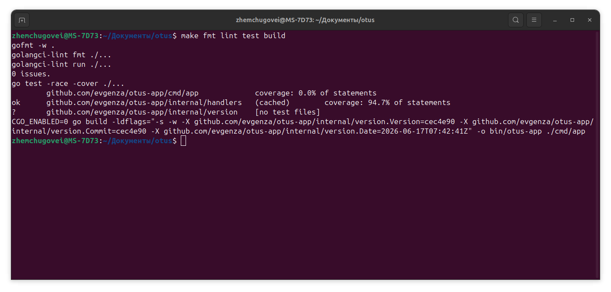
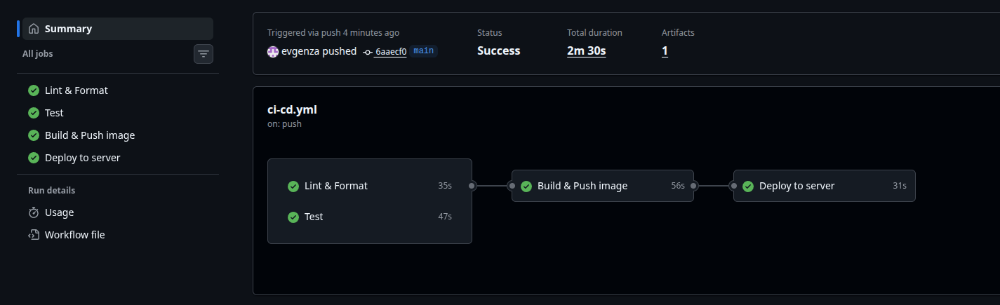
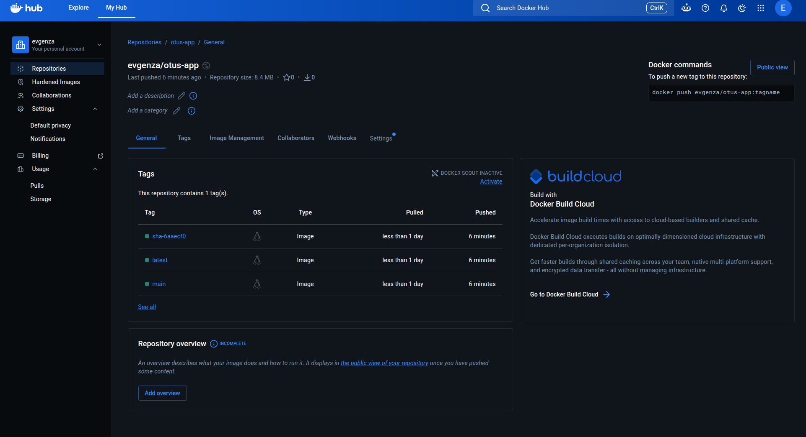
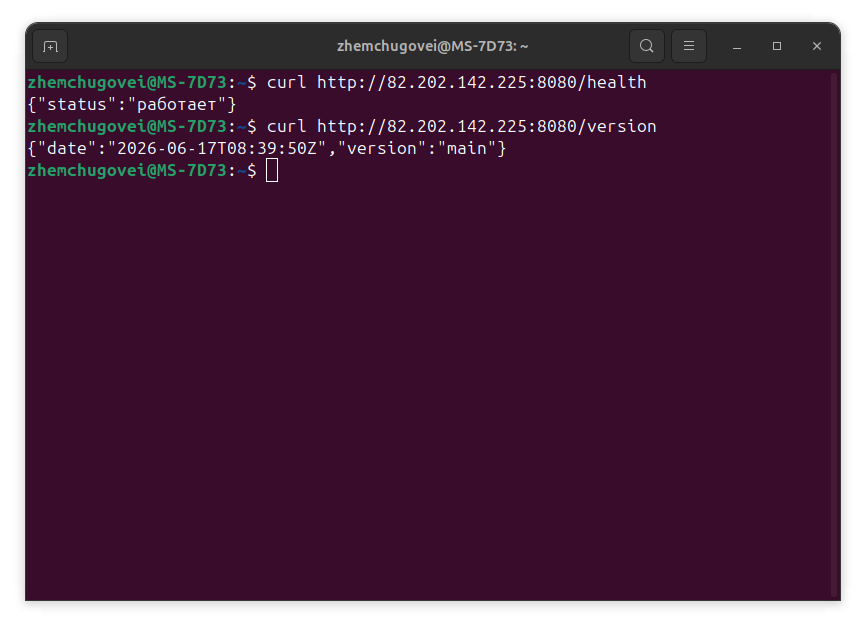

# Отчёт по ДЗ «Собираем приложение»

## Приложение

Написал небольшой HTTP-сервис на Go с тремя ручками: `/health`, `/version` и
`/hello`. Раскладка стандартная для Go — точка входа в `cmd/app`, внутренняя
логика во `internal/` (`handlers`, `version`). Версия и дата зашиваются в
бинарь при сборке через `-ldflags`.

## Локальная сборка

Все команды собраны в Makefile. Перед коммитом гоняю `make fmt lint test build`:

- `gofmt` и `golangci-lint` (конфиг `.golangci.yml`) — проходят без замечаний;
- `go test -race -cover` — тесты на хендлеры зелёные, покрытие пакета ~95%;
- бинарь собирается, ручки отвечают.



## CI/CD

Пайплайн в `.github/workflows/ci-cd.yml` разбит на отдельные этапы:

1. **lint** — проверка gofmt и golangci-lint (отдельный этап под линтер).
2. **test** — тесты с детектором гонок и контрольная компиляция.
3. **build-and-push** — multi-stage сборка образа и пуш в Docker Hub.
4. **deploy** — заход на сервер по SSH, `docker compose pull` и `up -d`.

lint и test запускаются на каждый pull request, сборка образа и деплой — при
пуше в `main`.

Прогон: [CI/CD в GitHub Actions](https://github.com/evgenza/otus-app/actions/runs/27678333098).



## Образ в Docker Hub

Образ `evgenza/otus-app` публикуется с тегами `latest`, именем ветки и коротким
SHA коммита: [evgenza/otus-app на Docker Hub](https://hub.docker.com/r/evgenza/otus-app).



## Запуск на сервере

Деплой едет на сервер `82.202.142.225` (Docker + docker compose). После
`docker compose up -d` контейнер поднимается и проходит health-check:

```
$ curl http://82.202.142.225:8080/health
{"status":"работает"}

$ curl http://82.202.142.225:8080/version
{"version":"latest","date":"..."}
```



## Pull request

[PR #2 — добавление и сборка приложения](https://github.com/evgenza/otus-app/pull/2)
