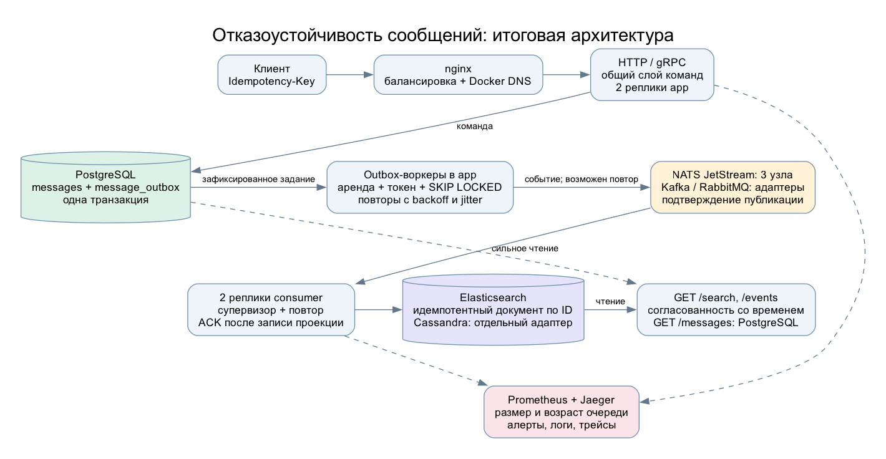
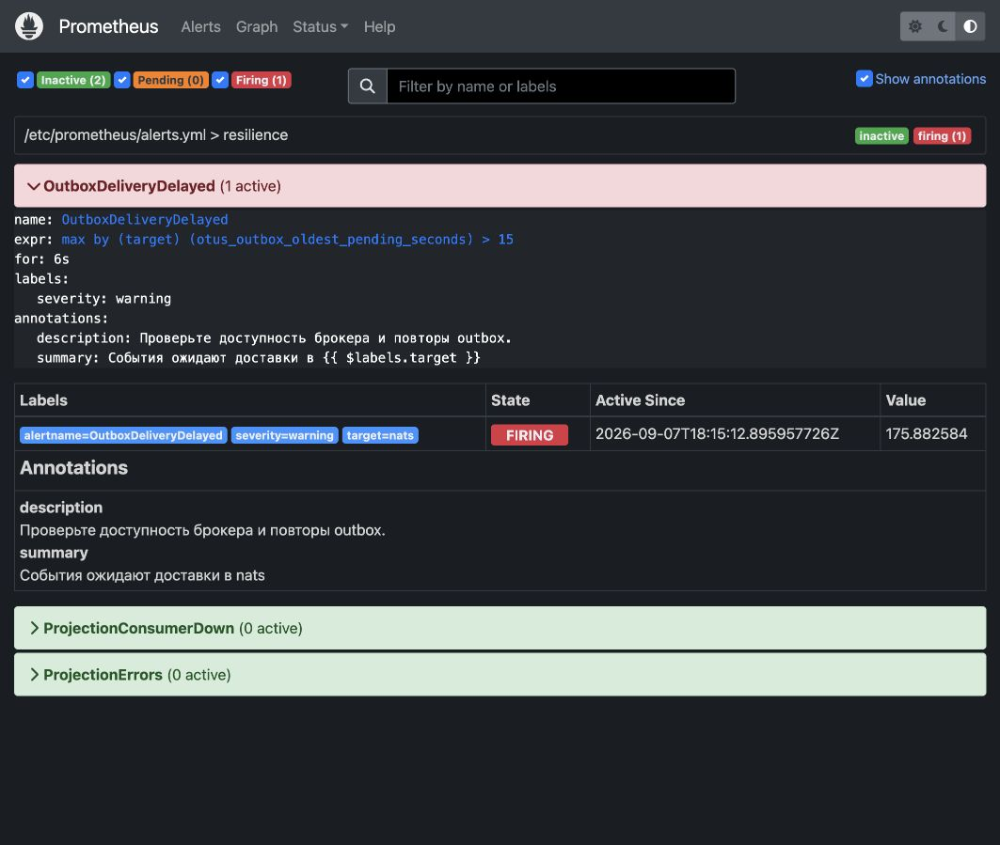
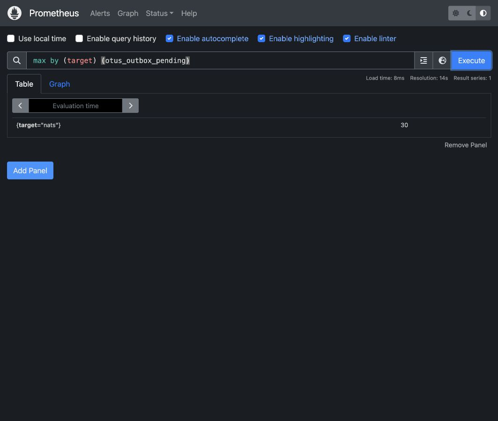
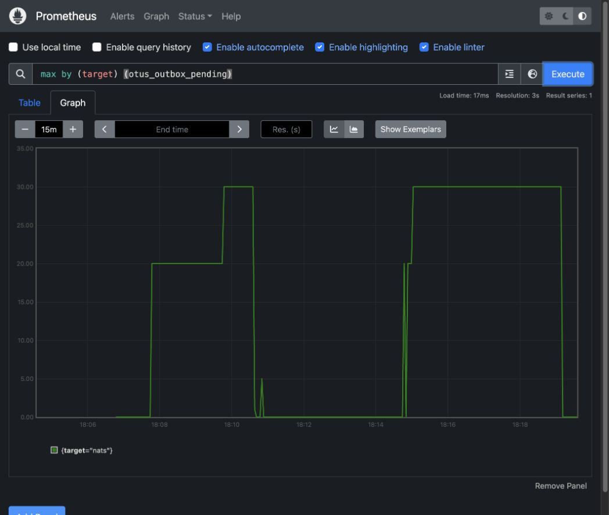
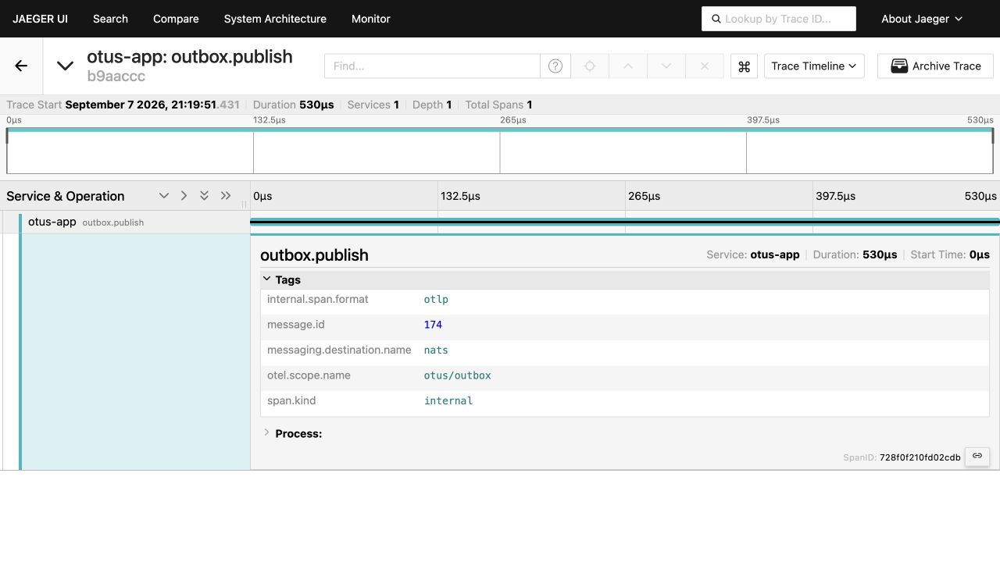

# ДЗ: отказоустойчивость микросервисов

## Что было не так

Сообщение сохранялось в PostgreSQL, а потом отдельно отправлялось в брокеры.
Если приложение падало между этими действиями, событие терялось. Недоступный
при запуске брокер вообще исключался из рассылки. Через gRPC сообщения
сохранялись без событий.

Еще нашел ошибку в Kafka consumer: после неудачной обработки он читал следующее
сообщение. Commit его смещения мог подтвердить и пропущенную запись.

## Что изменил

- Добавил transactional outbox. Сообщение и задания для брокеров записываются
  одной транзакцией. Отправка работает в фоне, после подтверждения брокера
  задание отмечается доставленным.
- Воркеры разбирают задания через `SKIP LOCKED`. Аренда - 45 секунд, токен
  защищает от устаревшего воркера. После сбоя задание можно забрать повторно.
  Задержка повторов растет до 30 секунд со случайным разбросом.
- Сделал общий слой команд для HTTP и gRPC. Один ключ идемпотентности с другим
  текстом теперь возвращает конфликт: HTTP 409 / gRPC `AlreadyExists`.
- Исправил подтверждения Kafka и добавил перезапуск упавших читателей.
  Ошибки обработки и некорректный JSON больше не подтверждаются.
- Ограничил сетевые операции таймаутами. Добавил `/ready` с проверкой PostgreSQL;
  `/health` остался проверкой живости процесса.
- Поднял две реплики приложения за nginx, два потребителя и три узла NATS.
  В nginx включил обновление Docker DNS: без этого после перезапуска контейнеров
  он продолжал обращаться к старым IP.
- Обновил gRPC до 1.83.1 из-за CVE-2026-84304 и CI actions до версий с Node 24.



## CQRS, саги и DDD

CQRS оставил на существующих хранилищах: команды пишут в PostgreSQL,
поиск и лента событий обновляются через брокеры в Elasticsearch и Cassandra.
Поиск может отставать от записи. Порты команд и запросов разделены
в `internal/application/messages`.

Саги и Temporal не добавлял. Создание сообщения - одна локальная транзакция.
Здесь нет отдельных бизнес-операций, для которых нужны компенсации.
Для доставки события достаточно outbox и повторной обработки.

По DDD вынес сообщение, событие создания и доменные ошибки в
`internal/domain/messaging`. Хранилище и gRPC больше не зависят от HTTP-модели.
Файловые операции и аудит в этой домашке не переделывал.

## Проверка

Локально: Go 1.26.6, golangci-lint 2.9.0, PostgreSQL 16, Docker Compose.
Прогон от 07.09.2026. Числа сохранены в
[resilience-local.json](evidence/resilience-local.json).

| Проверка | Результат |
|---|---|
| Линтер, `go vet`, сборка Go и Docker | Без ошибок, линтер: `0 issues` |
| Тесты с `-race`, интеграционные тесты PostgreSQL | Прошли |
| Откат транзакции, конкурентные повторы, аренды outbox | Прошли |
| Остановка одной реплики приложения | 10 сообщений приняты через вторую |
| Потеря кворума NATS и перезапуск обеих реплик приложения | 30 сообщений сохранены в outbox |
| Время записи при потере кворума | Максимум 15,49 мс |
| Восстановление брокеров | Очередь опустела, все события появились в поиске за 27,19 с |
| Остановка обоих потребителей | 10 событий дождались их запуска |
| Остановка Elasticsearch | 5 сообщений появились в поиске после восстановления |
| Повторная доставка | В поиске осталось 76 документов на 76 сообщений |
| Наблюдаемость | Проверены метрики, срабатывание и сброс алерта, JSON-логи и трейс |

Это результаты учебного стенда. PostgreSQL, nginx и Elasticsearch здесь
одиночные, все контейнеры работают на одном хосте. Потерю хоста стенд не покрывает.
Отказы в этом прогоне проверял на NATS и Elasticsearch; Kafka и RabbitMQ
проверены регрессионными тестами. Их кластерные стенды остались в `ds/`.

Доставка допускает повторы. Проекции используют стабильный ID сообщения.
Глобальный порядок событий не гарантируется. Недоставленные задания не удаляются;
при долгом отказе брокера нужно следить за размером outbox и свободным диском.
Аудит MongoDB и файловые операции пока не входят в эту гарантию.

## Скриншоты

Алерт при потере кворума NATS:



В очереди остаются 30 заданий:



После восстановления очередь падает до нуля. На графике видны два прогона;
длительное плато связано с подготовкой скриншотов.



Трейс фоновой доставки в Jaeger, `message.id=174`, брокер `nats`:



## Запуск и CI

```bash
make resilience-up
make resilience-test
make resilience-down
```

Для сценария проверки нужен Python 3.9+, без сторонних пакетов.
Приложение написано на Go. API - `localhost:18080`, Prometheus - `localhost:19090`,
Jaeger - `localhost:16687`. Порты открыты только на localhost, JWT и mTLS
в этом учебном стенде отключены. Данные сохраняются после остановки.

В CI добавил сборку образа, интеграционные тесты и тот же сценарий отказов.
Он блокирует публикацию образа в основном пайплайне. Логи, метрики и результаты
загружаются в артефакт `resilience-evidence`.

[PR с проверками](https://github.com/evgenza/otus-app/pull/15).
Инструкция по обычной сборке проекта - в [README](../README.md).

## Вывод

Отказ брокера больше не теряет событие и не задерживает запись сообщения.
После восстановления очередь доставляется, поиск догоняет PostgreSQL.

## Доработка по замечанию

- Jitter теперь общий для outbox, потребителей, HDFS, Cassandra и Elasticsearch.
  Разброс сохраняется при достижении максимальной задержки.
- Circuit breaker для Redis и Elasticsearch: три ошибки подряд открывают цепь,
  через 5-10 секунд разрешается один пробный вызов. Успех закрывает цепь.
- Redis не повторяет `INCR` при потере ответа. Elasticsearch повторяет только
  GET, HEAD и PUT с воспроизводимым телом; запись идет по стабильному ID.
- Тесты проверяют блокировку записи PostgreSQL, потерю HTTP-ответа после commit,
  потерю ответа Redis после `INCR` и отказ внешнего HTTP-сервиса после записи.
  На Docker-стенде дополнительно останавливаются PostgreSQL и Redis.
  Итоговые ID, текст и контрольные суммы сверяются между БД, outbox и поиском.

Метрики доступны на `/metrics`:

| Метрика | Что показывает |
|---|---|
| `otus_retry_attempts_total` | Повторы без первого вызова |
| `otus_retry_exhausted_total` | Исчерпание лимита попыток |
| `otus_circuit_breaker_calls_total` | Успехи, ошибки, отмены и отклонения |
| `otus_circuit_breaker_trips_total` | Открытия цепи после ошибок |
| `otus_circuit_breaker_transitions_total` | Переходы closed, open, half_open |
| `otus_circuit_breaker_state` | Текущее состояние: 0, 1, 2 соответственно |

Outbox и потребители продолжают повторы без ограничения по числу попыток.
Исчерпание считается для ограниченных повторов Elasticsearch, HDFS и Cassandra.
Добавлены алерты `DependencyCircuitOpen` и `RetryBudgetExhausted`.

Локально прошли линтер, сборка, тесты с `-race` и 13 сценариев на Docker-стенде.
Сверены 87 сообщений: потерь и дублей нет.
[Результат прогона](evidence/resilience-review.json).
При временном 502/503/504 тестовый клиент делает до трех попыток с jitter
и тем же ключом. Эти повторы сохраняются в поле `http_retries`.
