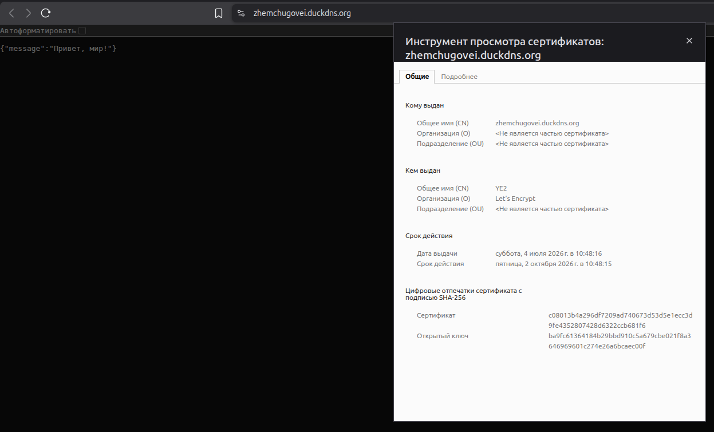
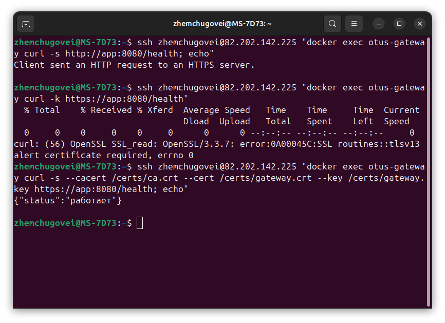
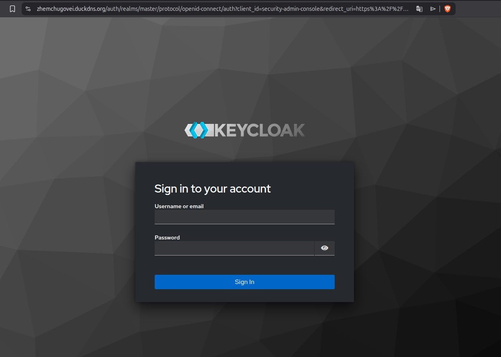
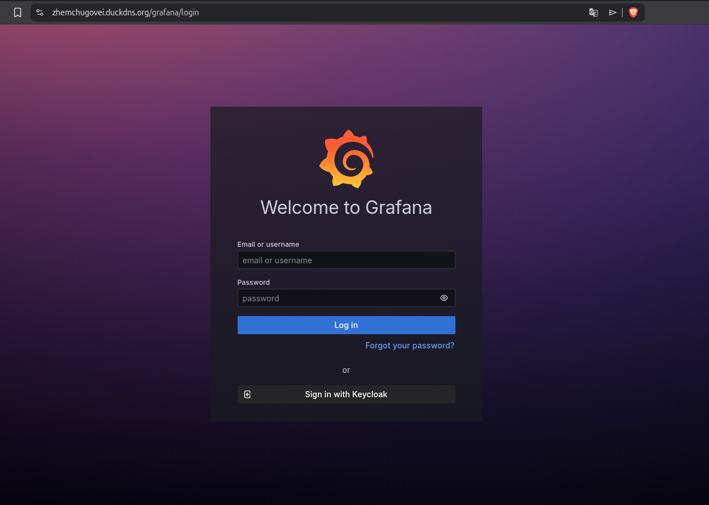
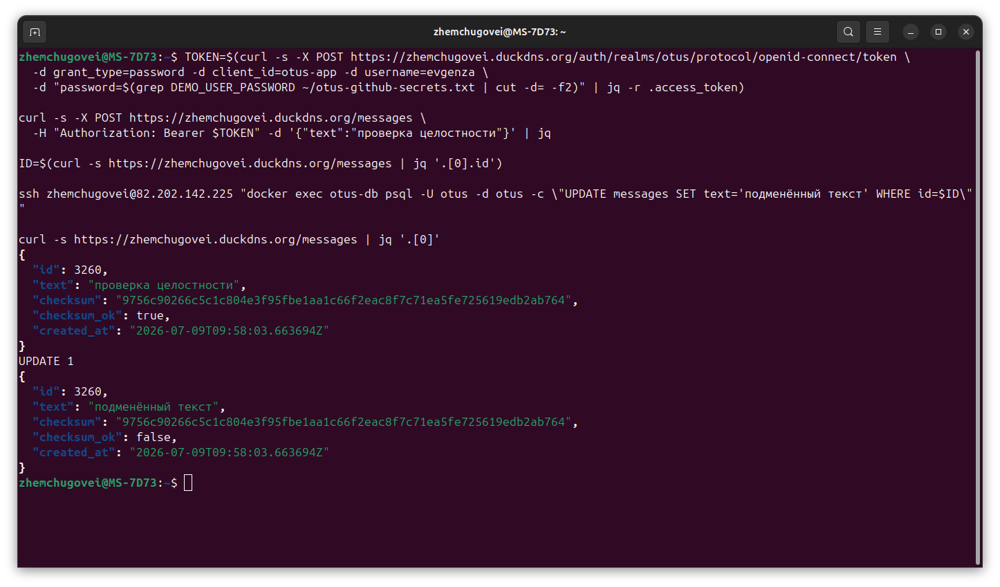

# Протокол проверки защиты otus-app

## Схема

```
Интернет ── HTTPS (Let's Encrypt) ──► nginx ──┬── mTLS ──► app ──► PostgreSQL
                                              ├── /gw/  ──► gateway ── mTLS ──► app
                                              ├── /auth/ ──► Keycloak (JWT)
                                              └── /grafana/, /prometheus/, /jaeger/, /alertmanager/, /kibana/
```

Четыре слоя защиты:

1. **TLS снаружи** — nginx терминирует HTTPS для `zhemchugovei.duckdns.org`,
   сертификат Let's Encrypt, продление через certbot. Наружу открыты только
   80 (редирект + ACME) и 443.
2. **mTLS внутри** — app принимает подключения только с клиентским
   сертификатом внутреннего CA. Сертификаты есть у gateway, nginx и
   Prometheus; посторонний процесс в сети до app не достучится.
3. **JWT через Keycloak** — `POST /messages` требует токен. App проверяет
   подпись RS256 по JWKS Keycloak, срок действия и издателя. Grafana входит
   через тот же Keycloak, а Prometheus/Alertmanager/Jaeger/Kibana закрыты
   oauth2-proxy (nginx `auth_request`) — единая точка авторизации на всё.
4. **Хеширование** — SHA-256 текста сообщения хранится в БД и сверяется при
   каждом чтении: подмена данных в обход API видна сразу.

## 1. TLS для внешних подключений

HTTP отвечает редиректом, HTTPS — валидным сертификатом:

```
$ curl -sI http://zhemchugovei.duckdns.org/health | head -2
HTTP/1.1 301 Moved Permanently
Location: https://zhemchugovei.duckdns.org/health

$ curl -s https://zhemchugovei.duckdns.org/health
{"status":"работает"}

$ curl -sv https://zhemchugovei.duckdns.org/ 2>&1 | grep -E "subject|issuer"
*  subject: CN=zhemchugovei.duckdns.org
*  issuer: C=US; O=Let's Encrypt; CN=...
```



## 2. mTLS между микросервисами

App слушает только TLS и требует клиентский сертификат
(`tls.RequireAndVerifyClientCert`). Проверки изнутри docker-сети:

```
$ curl http://localhost:8080/health
Client sent an HTTP request to an HTTPS server.

$ curl -k https://localhost:8080/health
curl: (56) OpenSSL SSL_read: ... alert certificate required

$ curl --cacert certs/ca.crt --cert certs/gateway.crt --key certs/gateway.key \
    https://localhost:8080/health
{"status":"работает"}
```

Сертификат, подписанный чужим CA, тоже отклоняется — это закреплено юнит-тестами
(`internal/security/tls_test.go`: рукопожатие, отказ без сертификата, отказ
чужому CA). Цепочка `gateway → app` и скрейп Prometheus ходят по mTLS, в Jaeger
трейс всей цепочки остаётся сквозным.



## 3. JWT через Keycloak

Keycloak поднят как отдельный сервис (realm `otus`, клиент `otus-app`),
проксируется через nginx: `https://zhemchugovei.duckdns.org/auth/`.

Без токена — 401:

```
$ curl -X POST https://zhemchugovei.duckdns.org/messages -d '{"text":"без токена"}'
{"error":"требуется токен авторизации"}          # HTTP 401
```

С поддельным токеном — тоже 401:

```
$ curl -X POST .../messages -H "Authorization: Bearer подделка" -d '{"text":"x"}'
{"error":"недействительный токен"}               # HTTP 401
```

Получаем токен по паролю (Direct Access Grant) и повторяем:

```
$ TOKEN=$(curl -s -X POST \
    https://zhemchugovei.duckdns.org/auth/realms/otus/protocol/openid-connect/token \
    -d grant_type=password -d client_id=otus-app \
    -d username=evgenza -d password='...' | jq -r .access_token)

$ curl -X POST https://zhemchugovei.duckdns.org/messages \
    -H "Authorization: Bearer $TOKEN" -d '{"text":"защищённое сообщение"}'
{"id":8146,"text":"защищённое сообщение",
 "checksum":"7cb1c348f69228920a8f9b607941ded9c705334d49fe54c583f78090a98d524a",
 "checksum_ok":true,"created_at":"..."}          # HTTP 201
```

App проверяет токен сам: скачивает JWKS realm-а, сверяет подпись RS256, `exp`
и `iss` (`internal/security/jwt.go`). Негативные сценарии — просроченный токен,
чужой ключ подписи, неверный издатель — покрыты юнит-тестами.

Grafana авторизуется через тот же Keycloak (generic OAuth): на форме входа —
кнопка «Keycloak», вход под пользователем realm-а.

Prometheus, Alertmanager, Jaeger и Kibana своей авторизации не имеют, поэтому закрыты
oauth2-proxy: на каждый запрос nginx делает `auth_request` в oauth2-proxy, без
сессии Keycloak отдаёт редирект на страницу логина:

```
$ curl -sI https://zhemchugovei.duckdns.org/prometheus/ | head -2
HTTP/1.1 302 Moved Temporarily
Location: https://zhemchugovei.duckdns.org/oauth2/start?rd=...
```

После входа под пользователем realm-а UI открываются как обычно.




## 4. Хеширование для проверки данных

При создании сообщения app считает SHA-256 текста и сохраняет в колонку
`text_hash`. При чтении хеш пересчитывается и сравнивается. Ломаем данные
напрямую в БД, минуя API:

```
$ docker exec otus-db psql -U otus -d otus \
    -c "UPDATE messages SET text='подменённый текст' WHERE id=3260"
UPDATE 1

$ curl -s https://zhemchugovei.duckdns.org/messages | jq '.[0]'
{
  "id": 3260,
  "text": "подменённый текст",
  "checksum": "9756c90266c5c1c804e3f95fbe1aa1c66f2eac8f7c71ea5fe725619edb2ab764",
  "checksum_ok": false,
  ...
}
```

Подмена обнаружена: сохранённый хеш не совпадает с хешем текущего текста,
в лог пишется предупреждение «контрольная сумма сообщения не совпадает».
Пароли пользователей при этом хеширует сам Keycloak (Argon2), в открытом виде
они нигде не лежат.



## Секреты и ключи

- приватные ключи mTLS генерируются скриптом на сервере и не покидают его,
  в git — только скрипт (`observability/certs/gen-certs.sh`);
- realm Keycloak и конфиг Alertmanager лежат в репозитории шаблонами, секреты
  подставляются в CI из GitHub Secrets (`envsubst`);
- пароли Keycloak/Grafana и секреты oauth2-proxy задаются секретами
  `KEYCLOAK_ADMIN_PASSWORD`, `GRAFANA_ADMIN_PASSWORD`, `GRAFANA_OAUTH_SECRET`,
  `OAUTH2_PROXY_CLIENT_SECRET`, `OAUTH2_PROXY_COOKIE_SECRET`,
  `DEMO_USER_PASSWORD`.

## Оценка

- Снаружи доступны только 80/443; прямые порты сервисов с сервера убраны,
  весь трафик идёт через nginx с валидным TLS.
- Подключиться к app мимо nginx/gateway нельзя — mTLS отсекает клиентов без
  сертификата внутреннего CA ещё на рукопожатии.
- Запись в API возможна только с живым токеном Keycloak; проверка подписи
  локальная (по JWKS), лишних походов в Keycloak на каждый запрос нет.
- Целостность данных контролируется на уровне приложения: ручная правка БД
  видна в API мгновенно.
- Все веб-морды закрыты одной точкой авторизации: Grafana — родным OAuth,
  Prometheus/Alertmanager/Jaeger/Kibana — через oauth2-proxy, и всё это один
  Keycloak с одними и теми же пользователями.

## Pull request

- [PR #9 — mTLS, TLS через nginx, Keycloak, контрольные суммы](https://github.com/evgenza/otus-app/pull/9)
- [PR #10 — веб-интерфейсы за oauth2-proxy, ELK на сервере](https://github.com/evgenza/otus-app/pull/10)
